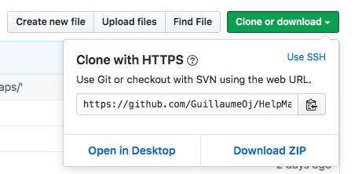

# Présentation
Le but du projet est de réaliser un jeu de labyrinthe. Le joueur part d’un point de départ et doit arriver à la sortie du labyrinthe en ayant collecté un certain nombre d’objets sur son chemin afin de neutraliser le gardien situé à la sortie !
Le jeu tourne autour de l’univers de MacGyver. Le joueur prend le contrôle du héros de la série.
Le but du projet est de réaliser un jeu de labyrinthe. La ou le joueu·r·se part d’un point de départ et doit arriver à la sortie du labyrinthe en ayant collecté un certain nombre d’objets sur son chemin afin de neutraliser le gardien situé à la sortie !
Le jeu tourne autour de l’univers de MacGyver. La ou le joueu·r·se prend le contrôle du héros de la série.

## Ressources
Ce jeu utilise des ressources graphiques, fournies en amont du projet, telles que des images des personnages, des textures pour le labyrinthe ainsi que les d’objets à collecter. Toutes ces ressources sont stockées dans le répertoire « ressources/» à la racine du projet.

## Fonctionnalités
Les fonctionnalités de base demandées dans le jeu sont les suivantes:
- Le jeu comporte un seul niveau.
- Le niveau est écrit dans un fichier facilement modifiable.
- Le héros se déplace grâce aux flèches directionnelles du clavier.
- Le labyrinthe a un format de 15x15 sprites (cases).
- Les objets, que le héros collecte, sont placés de manière aléatoire dans le labyrinthe. Ainsi pour chaque partie les objets ne sont pas au même endroit.
- Le héros ramasse les objets dès qu’il se trouve sur la même case que ceux-ci.
- Si le héros se présente devant le gardien sans avoir collecté l’ensemble des objets, il perd la partie. Donc le héros gagne uniquement si il a tout les objets et qu’il trouve la sortie.
- Le programme doit pouvoir s’exécuter sur n’importe quel ordinateur.

## Technologies
Il est demandé de réaliser le programme en utilisant **Python 3**.
Le programme s'appuie aussi sur l’utilisation du module Pygame permettant la réalisation rapide de jeu avec le langage python (création de fenêtre graphique, gestion de la souris et du clavier, etc.).
Dans le présent programme les versions utilisées sont :
- Python 3.7.4 : https://www.python.org/
- Pygame 1.9.6 : https://www.pygame.org/

# Installation et utilisation

## Dépôt
L’ensemble du code source est hébergé sur la plateforme [GitHub](http://github.com). Le dépôt contenant ce code source est le suivant : https://github.com/GuillaumeOj/HelpMacGyver
Pour récupérer ce code source, il y a deux possibilités :
1. En cliquant sur « Clone or download » on télécharge l’ensemble du code source au format zip que l'on décompresse dans un dossier de notre choix :



2. Ou en utilisant le logiciel [Git](https://git-scm.com/) (voir l'[Aide](https://git-scm.com/doc) du logiciel). Dans une console, on se dirige sur le dossier de destination du code source puis on tape la commande suivante:
```
git clone git@github.com:GuillaumeOj/HelpMacGyver.git
ou
git clone https://github.com/GuillaumeOj/HelpMacGyver.git
```

## Installation
Une fois le code source récupéré il reste l'installation du module `pygame`.
Pour une bonne utilisation, il est conseillé d'utiliser un environnement virtuel tel que [Virtualenv](https://github.com/pypa/virtualenv) (voir la [documentation](https://virtualenv.pypa.io/en/latest/#)).
Une fois que Vitualenv est installé, on se positionne sur le répertoire contenant le projet et on lance la commande suivante dans une console :
```
virtualenv -p python3 env
```
ou sur PowerShell:
```powershell
virtualenv -p $env:python3 env
```
Ensuite pour activer l'environnement virtuel on tape la commande suivante :
```
source env/bin/activate
```
ou sur PowerShell:
```powershell
.env/scripts/activate.ps1
```
Enfin, grâce au module `pip` on installe les modules nécessaires au fonctionnement du programme (*pygame*) :
```
pip install -r requirements.txt
```

## Exécution
Pour exécuter le programme on lance la commande suivante dans une console :
```
python main.py
```
Toute les instructions d'installation sont récapitulées dans le fichier [readme.md](../readme.md) présent à la racine du code source.